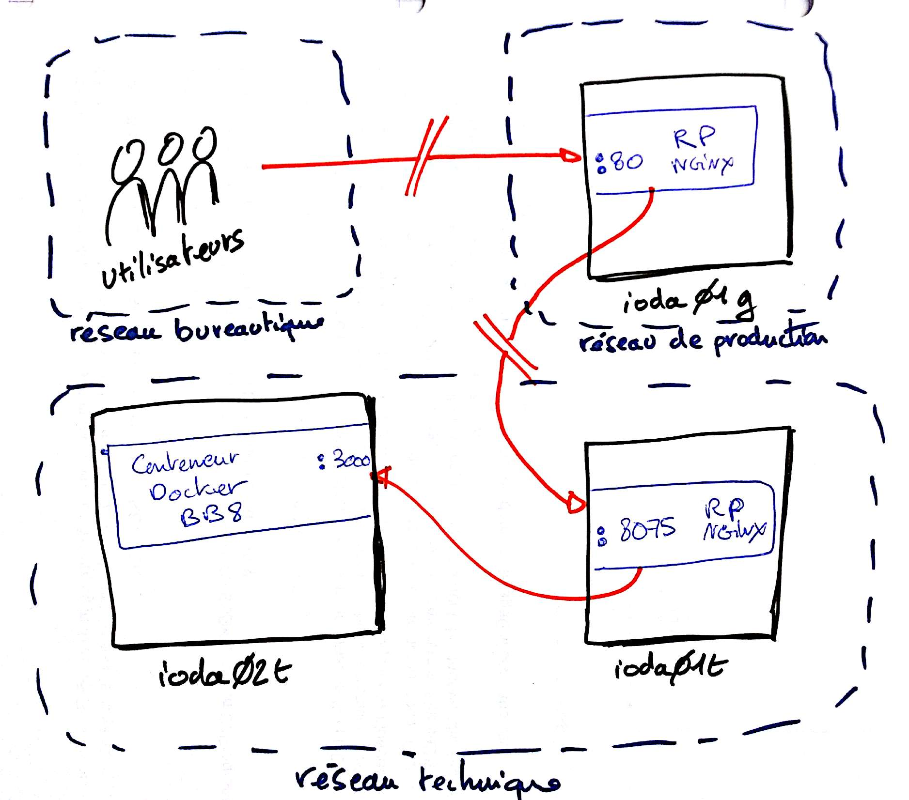

# BB-8

Project with Angular 2.

## Guide du développeur

- Clone or fork this repository
- Make sure you have [node.js](https://nodejs.org/) installed version 5+
- Make sure you have NPM installed version 3+
- `WINDOWS ONLY` run `npm install -g webpack webpack-dev-server typescript` to install global dependencies
- run `npm install` to install dependencies
- run `npm start` to fire up dev server
- open browser to [`http://localhost:3000`](http://localhost:3000)
- if you want to use other port, open `package.json` file, then change port in `--port 3000` script

- if using nvm :
** `sudo apt-get install nvm`
** select node version : `nvm ls-remote`
** install node version : `nvm install v7.2.0` 

## Processus de release

- Changer le n° de version dans le fichier version.json en ajoutant les modifications.
- Mettre à jour le changelog
- Poser un tag correspondant au n° de version avec la commande: git tag -a "1.2.3"
- Pousser le tag.

----

## Guide de l'intégrateur

### Environnement d'intégration

[http://bb8.integration.ioda.services.local](http://bb8.integration.ioda.services.local)

Sur l'environnement d'intégration, l'application est déployée sous forme de 
conteneur Docker écoutant sur le port `3000` du serveur `ioda02t`. Le serveur 
d'intégration `ioda02t` est sur le réseau technique.

Les utilisateurs étant sur le réseau bureautique, nous devons faire transiter 
les requêtes HTTP via le réseau de production afin qu'elles puissent atteindre
le réseau technique.

Un tel flux est déjà en place entre le serveur `ioda01g`  et le serveur `ioda01t`.

    Utilisateur --> ioda01g:80 --> ioda01t:8075 --> ioda02t:3000

#### Configuration du reverse proxy de ioda01g

    server {
            listen   80;
            server_name bb8.integration.ioda.services.local;
    
            location / {
                    proxy_pass http://ioda01t.bbo1t.local:8075;
                    proxy_set_header Host            $host;
                    proxy_set_header X-Forwarded-For $remote_addr;
            }
    }
    
    
#### Configuration du reverse proxy de ioda01t

    server {
            listen  8075;
            server_name bb8.integration.ioda.services.local;
    
            location / {
                     proxy_pass http://ioda02t.bbo1t.local:3000;
            }
    }

#### Configuration de orientdb

Il faut activer le CORS

Ouvrir le fichier config/orientdb-server-config.xml
    
Rajouter la ligne :

    <parameter name="network.http.additionalResponseHeaders" value="Access-Control-Allow-Origin: http://bb8.integration.ioda.services.local/;Access-Control-Allow-Credentials: true;Access-Control-Allow-Headers: Content-Type;Access-Control-Allow-Methods: POST, GET, DELETE, HEAD, OPTION" />

En dessous de :

    <parameter value="utf-8" name="network.http.charset"/>

#### Construction de l'image docker et création du conteneur

    ssh ioda02t.bbo1t.local
    su - integration # integration
    cd /data/integration/BB-8
    
    # récupération du dernier code
    git fetch
    git reset --hard un-tag-ou-un-commit
    
    # création de l'image Docker
    docker-compose build
    
    # recréation du conteneur
    docker-compose up -d --force-recreate
    
    # chauffer l'application en lançant une première requête
    curl http://localhost:3000/
    
    # vérifier les logs
    docker-compose logs -f  # ctrl-c pour quitter

### Environnement de production

#### Générer le livrable manuellement

Exécuter le script `build-release.sh` et récupérer le .tgz produit.

#### Générer le livrable avec Docker

Voir [docker-builder/README.md](docker-builder/README.md).

#### Déployer le livrable sur un serveur web

    # en supposant que le document_root du serveur web est `/var/www/html`
    mkdir /var/www/html/bb8
    tar xzf bb8-xxxxxxx.tgz -C /var/www/html/bb8/

## Sauvegarde

- Aucun ficher n'est créer par BB-8.
- Aucun index elastic search n'est changé par BB-8.

## Vérifier le fonctionnement des URL de BB-8

    - Démarrer application 'http://bb8.integration.ioda.services.local' => donne un menu avec des carrés.
    - Aller dans un des carrés => Voir s'il n'y a pas d'erreur avec les liens.
    - Une fois dans un de ces carrés, cliqué sur le bouton rechercher pour faire une recherche => Apparition d'un tableau.
    - Une fois le tableau apparu, appuyer sur un des champs du tableau cela arrive sur un nouvel onglet => Voir s'il n'y a pas d'erreur avec les liens.

## Ajout / Mettre à jour / créer la documentation du code.

    - Pour la syntaxe des commentaires voir le site 'http://typedoc.org/guides/doccomments/'
    - Aller dans tsconfig.json => changer "target" : "es5" par "target" : "es6".
    - Supprimer l'ancienne Doc dans le dossier Documentation.
    - Revenir à la racine du repertoire et lancer la commande suivante : 'typedoc --out ./Documentation ./src/app --name BB-8 --hideGenerator'.
    - Revenir dans tsconfig.json => changer "target" : "es6" par "target" : "es5".

### Accés à la documentation du code.

    - Aller à la racine du projet.
    - Lancer 'cd Documentation' puis 'firefox index.html'.
